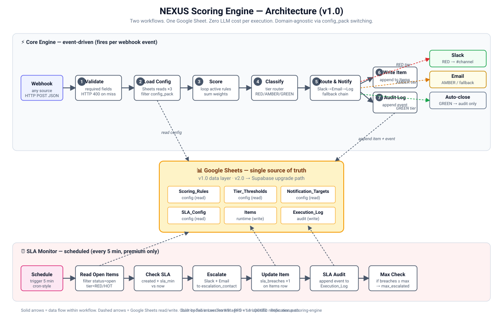

# nexus-scoring-engine

A configurable scoring + routing engine for n8n. Receives any JSON event via webhook, scores it against rules in a Google Sheet, classifies into priority tiers, and routes to Slack / email with full audit trail. Domain-agnostic: ships with Alert Triage and Lead Qualification config packs.

| | |
|---|---|
| Status | v1.0 — production-ready |
| n8n version | 1.x |
| Recurring cost | $0 (Google Sheets + Slack free tiers) |
| Deterministic | Same input → same score, every run |
| LLM calls | 0 |

---

## What It Does

1. **Ingest**: webhook accepts any JSON payload. Validates required fields, returns HTTP 400 on schema errors.
2. **Score**: loops through rules in a Google Sheet, sums weights for matching conditions. Pure arithmetic, no LLM.
3. **Classify**: maps total score to a tier — RED / AMBER / GREEN for alerts, HOT / WARM / COLD for leads.
4. **Route**: posts to Slack channel + emails the assigned team for high-priority items. Auto-closes low-priority. Falls back from Slack → email → error log.
5. **Audit**: every item + every event written to two Google Sheets tabs. Queryable trail for compliance / review.
6. **SLA monitor** (Premium): scheduled workflow checks open high-priority items every 5 min. Escalates breaches up to a configurable max count.

Buyer changes domain by editing one spreadsheet column (`config_pack`) — no workflow edits.

---

## Architecture



Two workflows. Core Engine fires per webhook event (event-driven). SLA Monitor fires every 5 min (scheduled). Both read the same Google Sheets workbook. Sheets is the single source of truth for rules, thresholds, targets, and runtime state.

Full diagram: `docs/architecture_diagram.svg` (rendered in Phase 9).

---

## What's In This Repo

| File | Free / Premium | Description |
|---|---|---|
| `README.md` | Free | This file |
| `docs/architecture_diagram.svg` | Free | One-page system diagram |
| `workflows/NEXUS_Lite_Alert_Triage.json` | **Free** | 19-node Lite workflow — alert_triage, no fallbacks |
| `workflows/NEXUS_Lite_Lead_Qual.json` | **Free** | 19-node Lite workflow — lead_qual, no fallbacks |
| `workflows/NEXUS_Core_Engine.json` | Premium ($49) | 28-node Core Engine — full error handling + fallbacks |
| `workflows/NEXUS_SLA_Monitor.json` | Premium | Scheduled SLA breach detection + escalation |
| `workflows/NEXUS_Test_Data_Generator.json` | Premium | 7 preset payloads (alert + lead + malformed), self-verifying |
| `config/lead_qual_config_seed.md` | Premium | TSV blocks for 16 lead_qual rules + thresholds + targets |
| `config/alert_triage_config_seed.md` | Premium | TSV blocks for 5+ alert_triage rules + thresholds + targets |

**Premium download** ($49 — Gumroad): https://talvinleegen.gumroad.com/l/nexus-scoring-engine
**Free Alert Triage**: [n8n Community (SecOps)](https://creators.n8n.io/workflows/15286) *(under review)*
**Free Lead Qualification**: n8n Community (Lead Generation) *(under review)*

---

## Quick Start (Free Lite)

Setup target time: < 20 minutes.

### 1. Prerequisites

- **n8n** running (cloud or self-hosted, v1.x)
- **Google account** with Sheets access
- **Slack workspace** with permission to create an Incoming Webhook (or skip Slack — falls back to no-notification mode for the Lite version)

### 2. Duplicate the Google Sheets Template

Open the [NEXUS Config Template](https://docs.google.com/spreadsheets/d/TEMPLATE-ID-PUBLIC/copy) and click **Make a copy**. The workbook has 6 tabs:

| Tab | Role |
|---|---|
| `Scoring_Rules` | Rule definitions (field, operator, value, weight) |
| `Tier_Thresholds` | Score ranges → tier name → action |
| `Notification_Targets` | Per-tier Slack channel + email list |
| `SLA_Config` | Per-tier SLA minutes + escalation count (Premium only) |
| `Items` | Runtime data — every scored item appended here |
| `Execution_Log` | Audit trail — every event appended here |

Note the workbook ID from the URL — you'll need it in step 4.

### 3. Import the Lite Workflow

In n8n: **Workflows → Import from File** → select either `NEXUS_Lite_Alert_Triage.json` or `NEXUS_Lite_Lead_Qual.json`.

The Lite versions have 19 nodes:

```
[Webhook] → [Validate] → [Load Rules] → [Load Thresholds] → [Score+Classify]
        → [Tier Router] → [Respond] + [Slack Send] → [Set Status] → [Write Item] → [Audit Log]
```

No SLA monitor. No Slack-fail fallback (premium feature). If Slack fails on an invalid URL, the webhook response will be empty — see PRD S8.1 buyer-config gate.

### 4. Connect Google Sheets Credential

In n8n: **Credentials → New → Google Sheets OAuth2 API**. Sign in with your Google account.

In each Sheets node of the imported workflow, set:
- Credential: the one you just created
- Document ID: paste your workbook ID from step 2
- Sheet name: per the node's role (`Scoring_Rules`, `Tier_Thresholds`, `Items`, `Execution_Log`)

### 5. Set Up Slack (Optional for Lite)

Create an Incoming Webhook in Slack: **Apps → Incoming Webhooks → Add to workspace → Choose channel → Copy URL**.

In the Slack Send node of the workflow, paste the URL into the URL field. Replace `#critical-alerts` (or `#sales-hot-leads` for lead_qual) placeholder text.

If you skip Slack, the Lite workflow returns an empty webhook response when high-priority items fire. Low-priority items still process correctly.

### 6. First Test

Activate the workflow. Copy the production webhook URL from the Webhook node.

Send a test payload (alert_triage):

```bash
curl -X POST https://your-n8n.com/webhook/alert-triage-lite \
  -H "Content-Type: application/json" \
  -d '{
    "alert_id": "TEST-001",
    "severity": "critical",
    "source": "datadog",
    "description": "Production DB connection pool exhausted",
    "config_pack": "alert_triage"
  }'
```

Or for lead_qual:

```bash
curl -X POST https://your-n8n.com/webhook/lead-qual-lite \
  -H "Content-Type: application/json" \
  -d '{
    "alert_id": "TEST-LEAD-001",
    "severity": "n/a",
    "source": "hubspot",
    "description": "Demo request from C-level",
    "config_pack": "lead_qual",
    "company_size": 600,
    "industry": "saas",
    "country": "United States",
    "role_seniority": "C-level",
    "demo_requested": "true",
    "pricing_page_visited": "true"
  }'
```

Expected response (success path):

```json
{
  "tier": "RED",
  "total_score": 75,
  "rules_triggered": ["RULE-001", "RULE-003", ...],
  "item_id": "uuid-here",
  "notification_status": "success_slack"
}
```

Check the `Items` tab — a new row should appear with `tier`, `total_score`, `rules_triggered`, and timestamp. Check `Execution_Log` — a `scored` event should appear.

---

## Configuration Reference

All behavior comes from the Google Sheet. No workflow edits required.

### Scoring_Rules tab

| Column | Type | Example |
|---|---|---|
| `rule_id` | text | `RULE-101` |
| `config_pack` | text | `lead_qual` or `alert_triage` |
| `field_name` | text | name of field on incoming JSON payload, e.g. `severity` |
| `operator` | text | one of: `equals`, `not_equals`, `greater_than`, `less_than`, `greater_equal`, `less_equal`, `contains`, `not_contains`, `exists`, `not_exists` |
| `value` | text/number | comparison value |
| `weight` | integer | points added if rule matches |
| `active` | TRUE/FALSE | toggle without deleting the row |
| `description` | text | human-readable note |

### Tier_Thresholds tab

| Column | Example |
|---|---|
| `config_pack` | `alert_triage` |
| `tier_name` | `RED` / `AMBER` / `GREEN` (or `HOT` / `WARM` / `COLD`) |
| `min_score` | `71` |
| `max_score` | `100` |
| `action` | `escalate` / `review` / `auto_close` |
| `notification_channel` | `slack` / `email` / `none` |

### Notification_Targets tab

| Column | Example |
|---|---|
| `config_pack` | `alert_triage` |
| `tier_name` | `RED` |
| `slack_channel` | `#critical-alerts` (or full webhook URL) |
| `email_list` | `oncall@company.com` |
| `escalation_contact` | `manager@company.com` |

### SLA_Config tab (Premium only)

| Column | Example |
|---|---|
| `config_pack` | `alert_triage` |
| `tier_name` | `RED` |
| `sla_minutes` | `30` |
| `escalation_message` | `ALERT: unacknowledged RED open for 30+ min` |
| `max_escalations` | `3` |

### Items tab (runtime)

Auto-populated by the engine. Columns: `item_id`, `config_pack`, `payload_summary`, `total_score`, `tier`, `rules_triggered`, `status`, `notification_status`, `sla_breaches`, `created_at`, `acknowledged_at`.

### Execution_Log tab (audit)

Auto-populated. Columns: `log_id`, `item_id`, `event_type`, `details`, `created_at`.

---

## Sample Configuration — alert_triage (5 rules)

Paste into `Scoring_Rules` tab. Header row: `rule_id	config_pack	field_name	operator	value	weight	active	description`

```tsv
RULE-001	alert_triage	severity	equals	critical	30	TRUE	Critical severity (highest weight)
RULE-002	alert_triage	severity	equals	high	18	TRUE	High severity
RULE-003	alert_triage	customer_facing	equals	true	15	TRUE	Customer-facing impact
RULE-004	alert_triage	environment	equals	production	12	TRUE	Production environment
RULE-005	alert_triage	error_count	greater_equal	100	10	TRUE	High error volume
```

Tier_Thresholds (paste 3 rows):

```tsv
alert_triage	RED	71	100	escalate	slack
alert_triage	AMBER	40	70	review	email
alert_triage	GREEN	0	39	auto_close	none
```

Notification_Targets (paste 3 rows, customize the placeholders):

```tsv
alert_triage	RED	#critical-alerts	oncall@company.com	manager@company.com
alert_triage	AMBER	#review-queue	team@company.com	
alert_triage	GREEN			
```

For the `lead_qual` config pack, see `config/lead_qual_config_seed.md` (Premium) — 16 rules covering firmographics, authority, behavioral intent, source, and timing/budget.

---

## Switching Config Packs

Set the `config_pack` parameter once in the workflow's webhook payload (or as a workflow variable). The engine filters every Sheets read by `config_pack`. To run the same engine for a third domain (e.g. `support_tickets`):

1. Add new rows to `Scoring_Rules`, `Tier_Thresholds`, `Notification_Targets`, `SLA_Config` with `config_pack=support_tickets`.
2. Send webhook payload with `"config_pack": "support_tickets"`.

No workflow edits.

---

## Test Data Generator (Premium)

`NEXUS_Test_Data_Generator.json` is a 7-node workflow that POSTs preset payloads to your imported Core Engine (or Lite). Ships with 7 scenarios:

| Scenario | Pack | Expected |
|---|---|---|
| `alert_RED` | alert_triage | tier=RED, HTTP 200 |
| `alert_AMBER` | alert_triage | tier=AMBER, HTTP 200 |
| `alert_GREEN` | alert_triage | tier=GREEN, HTTP 200 |
| `lead_HOT` | lead_qual | tier=HOT, HTTP 200 |
| `lead_WARM` | lead_qual | tier=WARM, HTTP 200 |
| `lead_COLD` | lead_qual | tier=COLD, HTTP 200 |
| `malformed_missing_fields` | alert_triage | error=VALIDATION_FAILED, HTTP 400 |

Configure `target_webhook_url` + `scenario_filter` in the Set Config node. Click Execute. Generator emits a per-scenario PASS/FAIL match against expected tier (or expected error). Final node aggregates a summary with pass-rate %.

Default `throttle_seconds=5` between sends respects the Google Sheets free-tier rate limit (60 reads/min/user).

---

## Limitations (v1.0)

- Google Sheets free tier rate-limits at ~60 reads/min — small teams (< 100 items/day) won't hit it. Higher volume → upgrade to Pro v2.0 (Supabase) when available.
- `contains` operator is case-sensitive in v1.0. Lowercase your `industry` / `tags` values when seeding rules. Documented in `config/lead_qual_config_seed.md` caveat #4.
- Slack webhook URL stored in `Notification_Targets.slack_channel` — secret leak risk if the workbook is shared. Rotate the webhook if you share read access.
- Boolean fields must be sent as strings `"true"`/`"false"` because the Sheet `value` column is text. Convert in your source before posting.
- End-to-end p95 ≈ 9s due to 3 sequential Sheets reads + Slack HTTP. Webhook-to-classify alone is < 5s (PRD K-2 target met). Caching planned for v1.1.

---

## Roadmap

- **v1.1** — config caching in n8n static data (drops Sheets reads from 3 to 0 per request), case-insensitive `contains` operator, full 8-page setup PDF, additional config pack (e.g. `support_tickets`).
- **v2.0** — Supabase data layer (queryable audit trail, row-level security, dashboard-ready). Migration script provided. Triggered when 3+ buyers request OR 5+ Premium copies sold.
- **v3.0** — optional LLM-based scoring add-on module. Strict opt-in, additive cost.

---

## License

MIT — see `LICENSE`.

You are free to use, modify, and redistribute. The premium workflows are licensed per single buyer (no resale of the JSON itself). The free Lite versions and this README are unrestricted.

---

## Support

- **Free Lite issues**: open a GitHub issue. Best-effort response.
- **Premium support**: 5 business days post-purchase via email — talvinleegenwei0329@gmail.com. PRD §S6.2.
- **Custom builds** (Quick Setup / Quick Build / Full Build): see Gumroad listing or email direct. Response SLA 48 hours.

Built by [Talvin Lee Gen Wei](https://github.com/talvinleegenwei). Internal codename NEXUS — see PRD v1.1 LOCKED for full architecture.
